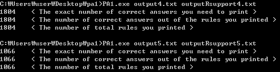

# Data Science PA1

### Apriori 구현

컴퓨터전공 2012004162 이창민


## Environment

- OS : Mac OS, Windows
- Languages : Python(3.6.4)


## Algorithms

* Make frequent pattern
* Find association rules


### Make frequent pattern

Input.txt 로 부터 Data를 입력받아 Apriori Algorithm 을 활용하여 Frequent Pattern을 구하는 부분의 소스코드 입니다. (*C(n), L(n) : 길이가 n인 ItemSet들의 배열)

```python
while len(C) != 0:     #1
    for item in C:
        support = getSupport(item)

        #Frequent Pattern
        if support >= minSupport:     #2#
        	#Add to L
            L.append(item)
            if item not in frequentPatterns:     #3#
                frequentPatterns.append(item)

    #Generate C(n+1) from L(n)
    C = GenerateC()     #4#
    
    #Clear for L(n+1)
    L.clear()
```

- \#1 더이상 C(n)이 생성되지 않을 때 까지 반복문이 실행됩니다.


- \#2 C(n)가 생성되었다면, 각 ItemSet들의 Support 를 구하여, 사용자가 입력한 minSupport 와 비교합니다. 만약 minSupport보다 크거나 같다면, L(n)에 추가합니다.


- \#3 itemSet의 Support 가 min값 이상이므로 Frequent Pattern으로 저장합니다.


- \#4 생성된 L(n)을 GenerateC 함수를 통하여 C(n+1) 배열을 생성합니다.


### Find association rules

```python
def generateRules():
    rules = ""
    for pattern in filter(lambda x: len(x) > 1, frequentPatterns):  #1
        for subset in getAllSubsets(pattern):   #2
            rest = set(pattern) - set(subset)   #3
            rules += makeRuleStr(list(subset),list(rest)....)   #4
    return rules
```

- \#1 이전의 과정으로 저장된 모든 Frequent Patterns 중, 길이가 2 이상인 Set에 대하여 진행합니다.
- \#2 구현한 getAllSubsets 함수를 활용하여 Set의 모든 subset에 대하여 진행됩니다.
- \#3  전체 Set 과, \#2에서 구한 subset의 차집합을 구합니다.
- \#4 \#3에서 구한 두 Set을 통하여 rule을 생성합니다.


## Detailed description (Each Function)

### getSupport 

주어진 set의 support를 구하는 함수입니다.

```python
#Apriori.py
def getSupport(item):
	itemSet = frozenset(item)   #1

    #Cache hit
    if itemSet in cache:   #2
        return cache[itemSet]

    else:
        count = 0
        for transaction in transactions:   #3
            if set(item).issubset(set(transaction)):   
                count += 1
        support = roundTo2Dec(count / len(transactions) * 100)
        #Caching
        cache[itemSet] = support   #4
        return support
```

- \#1 hashable한 Set을 만들기 위해 frozenset을 활용하였습니다.
- \#2 Set에 대하여 사전에 caching된 support 값이 있다면 그 값을 return 합니다.
- \#3 cache가 없다면, 모든 transaction에 대하여 issubset 함수를 활용하여 유무를 체크합니다.
- \#4 계산된 support 값을 caching 합니다.


### GenerateC

생성된 L(n) 배열을 활용하여 C(n+1)을 생성하여 반환합니다.

```python
#Apriori.py
def GenerateC(Ln):
    candidates = []
    for i in range(0,len(Ln)):
        for j in range(i+1, len(Ln)):   #1
            c = sorted(list(set(Ln[i]) | set(Ln[j])))
            if len(c) == len(Ln[i]) + 1:   #2
                if pruning(Ln,c) and c not in candidates:   #3
                        candidates.append(c)
    return candidates
```

* \#1 주어진 L(n)의 모든 ItemSet 쌍에 대하여 진행합니다.
* \#2 만약 두 ItemSet을 합집합 연산을 하였을 때, Set의 길이가 n+1이라면 (n-1개가 공통 ex:abc,abd) pruning 알고리즘을 통하여 해당 Set을 생성 가능한지 확인합니다.
* \#3 필요한 subset이 모두 존재하고, 중복이 없다면 C(n+1)에 추가합니다.


### Pruning

길이가 n+1인 ItemSet C와 L(n)을 입력받아, C의 subset 중 길이가 n인 set들이 L(n)에 존재하는지 확인합니다.

```python
#Apriori.py
def pruning(Ln,c):
    for sub in set(getSubsets(c, len(c)-1)):   #1
        if sorted(list(sub)) not in Ln:
            return False
    return True
```

* \#1 c의 길이가 n인 모든 subset을 구하여, Ln에 존재하는지 확인합니다.

### GenerateRules

이전의 과정으로 저장된 Frequent Pattern들을 활용하여 Association Rule을 생성합니다.

```python
#Apriori.py
def generateRules():
    rules = ""
    for pattern in filter(lambda x: len(x) > 1, frequentPatterns):  #1
        for subset in getAllSubsets(pattern):   #2
            rest = set(pattern) - set(subset)   #3
            rules += makeRuleStr(list(subset),list(rest)....)   #4
    return rules
```

- \#1 이전의 과정으로 저장된 모든 Frequent Patterns 중, 길이가 2 이상인 Set에 대하여 진행합니다.
- \#2 구현한 getAllSubsets 함수를 활용하여 Set의 모든 subset에 대하여 진행됩니다.
- \#3  전체 Set 과, \#2에서 구한 subset의 차집합을 구합니다.
- \#4 \#3에서 구한 두 Set을 통하여 rule을 생성합니다.


### Utils

Apriori 구현에 필요한 함수들을 분리하여 구현하였습니다.

```python
#utils.py
def getAllSubsets(superSet):   #1
    result = set()
    for i in range(1, len(superSet)):
        result = result | set(itertools.combinations(superSet, i)) 

    return result

def getSubsets(superSet, length):   #2
    return set(itertools.combinations(superSet, length))

def roundTo2Dec(value):   #3
    return Decimal(str(value)).quantize(Decimal('0.01'), 
    rounding= ROUND_HALF_UP)

def makeRuleStr(lhs, rhs, support, conf):   #4
    return ("{%s}\t{%s}\t%0.2f\t%0.2f\n" % (",".join(map(str, lhs)), ",".join(map(str, rhs)), support, conf))
```

* \#1 getAllSubsets : itertools의 combinations함수를 활용하여 모든 길이의 subset을 구합니다.
* \#2 getSubsets : #1과 같은 원리로 지정한 길이의 subset을 구합니다.
* \#3 roundTo2Dec : ROUND_HALF_UP 방식으로 소수점 2째자리 까지 반올림하여 반환합니다.
* \#4 makeRuleStr : 출력에 필요한 값들을 인자로 받아 str을 생성합니다.


## Instructions for compiling


python3가 설치된 환경에서

 `python3 apriori.py [Support] [Input] [Output]` 을  terminal에서 실행합니다.


## Test Result



구현한 소스를 실행하여 나타난 output을 Test하여 나타난 결과입니다.


## FeedBack

### Round 

일반 round 함수를 사용 시 Round to the nearest even이 적용되어 잘못된 값이 나와 소수의 rule들이 테스트를 통과하지 못하였습니다. ROUND_HALF_UP 이 적용된 round 함수를 따로 구현하여 문제를 해결하였습니다.


### Performance 

처음 Frequent Pattern을 구하는 과정에서 모든 Transaction을 스캔합니다. 후에 Association Rule을 만들기 위하여 confidence를 구하는 과정에서도 Support값이 필요하여 다시 모든 Transaction을 구하는 반복작업이 발생하였습니다.

이를 해결하기 위해 frozenset을 활용하여 hashable한 Set을 생성하였습니다.

Support를 계산한 Set들을 hash table 기반으로 caching하여 반복되는 작업을 제거하였습니다. 

